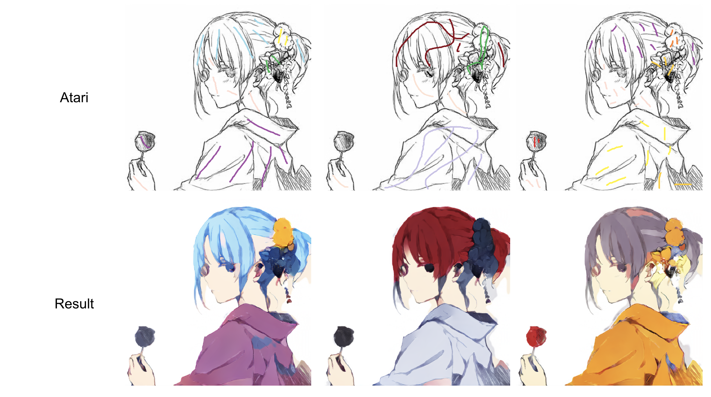
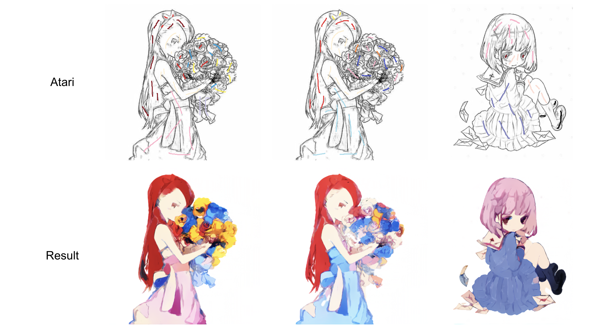

# Diverse Colorization

## Summary


- This method includes two steps
  - Taking line arts and hints (atari) as the inputs, UNet-like neural network named Flatter outputs flattened images.
  - Taking flattend images and injecting noise, Generator colorizes diversely.
- Improving diversity of the outputs of Generator is needed.

## Usage

### Training Flatter Phase
You need to set the value of `train.train_type` in `param.yaml` as `flat`. After that, execute the command line below.

```bash
$ python train.py --data_path <DATA_PATH> --sketch_path <SKETCH_PATH> --flat_path <FLAT_PATH>
```
- Descriptions
    - `DATA_PATH`: The name of the directory that contains frame files
    - `SKETCH_PATH`: The name of the directory that contains line arts obtained by SketchKeras
    - `FLAT_PATH`: The name of the directory that contains flattend images of data in `DATA_PATH`. Flatten images can be generated by using [DanbooRegion](https://github.com/lllyasviel/DanbooRegion).

### Training Generator Phase
You need to set the value of `train.train_type` in `param.yaml` as `multi`. After that, execute the command line below.

```bash
$ python train.py --data_path <DATA_PATH> --sketch_path <SKETCH_PATH> --flat_path <FLAT_PATH> --pretrain_path <PRETRAIN_PATH>
```
- Descriptions
    - `DATA_PATH`: The name of the directory that contains frame files
    - `SKETCH_PATH`: The name of the directory that contains line arts obtained by SketchKeras
    - `FLAT_PATH`: The name of the directory that contains flattend images of data in `DATA_PATH`
    - `PRETRAIN_PATH`: The name of pretrained Flatter file.

## Results

### Flatter Results




### Generator Results